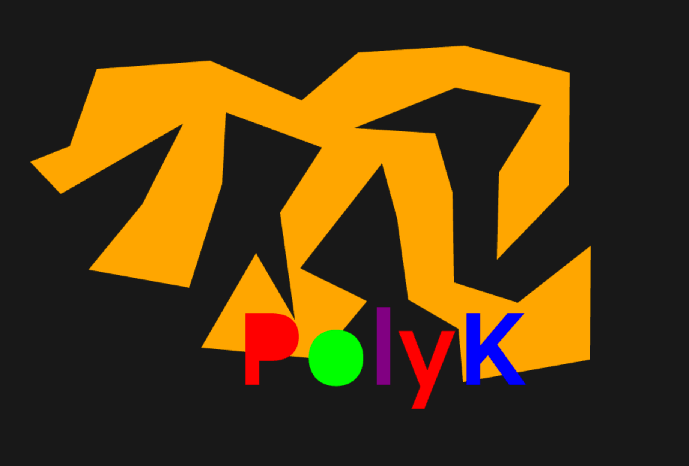

## Screenshots
* demo ( WebGL )
    
        Debug "Fine" showing rounded corners.
        
* toolkitTest ( Multiple Toolkits )
        
* ellipticalArc ( Kha - graphics2 )
        
* khaGraphics4Test ( Kha - graphics4 )      
        
* segmentTest ( Kha - graphics2 )           
        
* dotMatrixTest ( Kha - graphics2 )
        
* polyK ( Kha - graphics )                  
        
* poly2trihx ( Kha - graphics )
        
* fxg ( Kha - graphics )                    
        
* svg                                       not started
* linear gradient                           not started
* texture                                   not started
